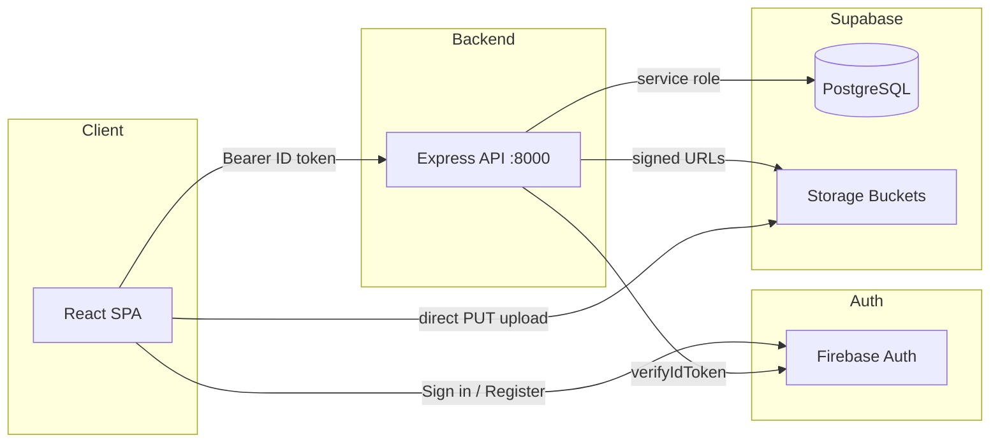

# OutsourceSoft

**B2B procurement platform connecting global buyers with verified Turkish manufacturers and service partners.**

OutsourceSoft manages the full sourcing workflow — from inquiry to delivery — with structured offers, document management, partner profiles, and real-time status tracking. Buyers post requirements; verified partners submit itemised bids; admins orchestrate matching, offers, and escalation.

Repository: [github.com/justege/outsourceSoft](https://github.com/justege/outsourceSoft)

---

## Table of contents

- [Features](#features)
- [Tech stack](#tech-stack)
- [Architecture](#architecture)
- [Project structure](#project-structure)
- [Prerequisites](#prerequisites)
- [Getting started](#getting-started)
- [Environment variables](#environment-variables)
- [Database setup](#database-setup)
- [Storage buckets](#storage-buckets)
- [User roles](#user-roles)
- [Application routes](#application-routes)
- [API reference](#api-reference)
- [Development](#development)
- [Deployment notes](#deployment-notes)
- [Troubleshooting](#troubleshooting)

---

## Features

### For buyers (clients)

- Post inquiries with category, urgency, quantity, and deadline
- Attach specification documents (PDFs, drawings)
- Receive and compare structured partner offers side by side
- Accept or decline offers; track inquiry status through delivery
- Team invitations and company contact preferences

### For partners (experts)

- Verified partner profile with bio, location, and availability
- Publish a **service catalogue** with pricing ranges and units
- Upload **company documents** (brochures, certifications, portfolios, price lists)
- Submit expert offers on matched inquiries
- Category-based matching via admin-assigned specialisations

### For administrators

- **Inquiry dashboard** — filter, assign experts, update status, add internal notes
- **Partner management** — view profiles, services, documents, and scoring
- **Offer builder** — compose project offers from expert bids and send to clients
- **Control panel** — user roles, categories, and platform oversight (superadmin)

### Marketing site

Public-facing pages with a professional B2B design:

`/how-it-works` · `/pricing` · `/integrations` · `/changelog` · `/about` · `/blog` · `/careers` · `/press` · `/privacy` · `/terms` · `/cookies` · `/help` · `/contact` · `/status` · `/partners`

---

## Tech stack

| Layer | Technology |
|-------|------------|
| Frontend | React 19, TypeScript, Vite, React Router 7 |
| UI | Chakra UI v3, React Hook Form, React Icons |
| Backend | Node.js, Express 4 |
| Auth | Firebase Authentication (email/password + Google) |
| Database | Supabase (PostgreSQL) |
| File storage | Supabase Storage (signed upload/download URLs) |
| Token verification | Firebase Admin SDK |

---

## Architecture



**Auth flow**

1. User signs in via Firebase on the frontend.
2. Frontend attaches the Firebase ID token as `Authorization: Bearer <token>` on every API request.
3. Backend verifies the token with Firebase Admin and resolves the user record in PostgreSQL via `firebase_uid`.
4. Role-based access is enforced server-side (`client`, `expert`, `admin`, `superadmin`).

**Document upload flow**

1. Client requests a signed upload URL from the API.
2. API creates a pending DB record and returns a Supabase signed URL.
3. Client uploads the file directly to Supabase Storage.
4. Client confirms the upload; API marks the document as confirmed.

---

## Project structure

```
outsourceSoft/
├── frontend/                 # React + Vite SPA
│   ├── src/
│   │   ├── api/              # Typed API client modules
│   │   ├── components/
│   │   │   ├── auth/         # Auth context, login/register shell
│   │   │   ├── inquiry/      # Inquiry document components
│   │   │   ├── marketing/    # Shared marketing layout & UI
│   │   │   └── ui/           # Chakra UI primitives
│   │   ├── layouts/          # Public & protected layouts
│   │   ├── pages/            # App pages
│   │   │   └── marketing/    # Public marketing subpages
│   │   └── lib/              # Firebase init, API helper
│   └── package.json
│
├── backend/                  # Express REST API
│   ├── src/
│   │   ├── routes/           # Route handlers
│   │   ├── middleware/       # Auth & role guards
│   │   ├── lib/              # Shared domain helpers
│   │   ├── db.js             # Supabase service client
│   │   ├── storage.js        # Bucket bootstrap & signed URLs
│   │   └── index.js          # Server entry point
│   ├── sql/                  # PostgreSQL migrations (run in order)
│   └── package.json
│
└── README.md
```

---

## Prerequisites

- **Node.js** 20+ (LTS recommended)
- **npm** 10+
- A **Firebase** project with Authentication enabled (Email/Password + Google optional)
- A **Supabase** project (PostgreSQL + Storage)

---

## Getting started

### 1. Clone the repository

```bash
git clone https://github.com/justege/outsourceSoft.git
cd outsourceSoft
```

### 2. Install dependencies

```bash
cd backend && npm install
cd ../frontend && npm install
```

### 3. Configure environment variables

See [Environment variables](#environment-variables) below. Create:

- `backend/.env`
- `frontend/.env`

### 4. Run database migrations

In **Supabase → SQL Editor**, run the migration files in order (see [Database setup](#database-setup)).

### 5. Start the development servers

**Terminal 1 — API**

```bash
cd backend
npm run dev
# → http://localhost:8000
```

**Terminal 2 — Frontend**

```bash
cd frontend
npm run dev
# → http://localhost:5173
```

Open [http://localhost:5173](http://localhost:5173). Register a new account to create your first user (default role: `client`).

---

## Environment variables

### Backend (`backend/.env`)

| Variable | Required | Description |
|----------|----------|-------------|
| `PORT` | No | API port (default: `8000`) |
| `VITE_SUPABASE_URL` | Yes | Supabase project URL |
| `SUPABASE_SERVICE_ROLE_KEY` | Yes | Service role key (server-side only — never expose to frontend) |
| `FIREBASE_PROJECT_ID` | Yes | Firebase project ID for token verification |
| `CORS_ALLOWED_ORIGINS` | No | Comma-separated allowed origins (default: `http://localhost:5173,http://localhost:3000`) |

**Example**

```env
PORT=8000

VITE_SUPABASE_URL=https://your-project.supabase.co
SUPABASE_SERVICE_ROLE_KEY=your-service-role-key

FIREBASE_PROJECT_ID=your-firebase-project-id

CORS_ALLOWED_ORIGINS=http://localhost:5173,http://localhost:3000
```

### Frontend (`frontend/.env`)

| Variable | Required | Description |
|----------|----------|-------------|
| `VITE_API_URL` | Yes | Backend API base URL |
| `VITE_FIREBASE_API_KEY` | Yes | Firebase web API key |
| `VITE_FIREBASE_AUTH_DOMAIN` | Yes | Firebase auth domain |
| `VITE_FIREBASE_PROJECT_ID` | Yes | Firebase project ID |
| `VITE_FIREBASE_STORAGE_BUCKET` | Yes | Firebase storage bucket (auth SDK) |
| `VITE_FIREBASE_MESSAGING_SENDER_ID` | Yes | Firebase messaging sender ID |
| `VITE_FIREBASE_APP_ID` | Yes | Firebase app ID |

**Example**

```env
VITE_API_URL=http://localhost:8000

VITE_FIREBASE_API_KEY=your-api-key
VITE_FIREBASE_AUTH_DOMAIN=your-project.firebaseapp.com
VITE_FIREBASE_PROJECT_ID=your-firebase-project-id
VITE_FIREBASE_STORAGE_BUCKET=your-project.firebasestorage.app
VITE_FIREBASE_MESSAGING_SENDER_ID=123456789
VITE_FIREBASE_APP_ID=1:123456789:web:abcdef
```

> **Security:** Never commit `.env` files. The root `.gitignore` excludes them.

---

## Database setup

Run migrations in **Supabase → SQL Editor** in this order:

| # | File | Purpose |
|---|------|---------|
| 001 | `001_create_users.sql` | Users table linked to Firebase UID |
| 002 | `002_roles_and_categories.sql` | Roles, categories, user–category junction |
| 003 | `003_marketplace_entities.sql` | Inquiries, expert offers, project offers |
| 004 | `004_fix_role_default.sql` | Role default fixes |
| 005 | `005_expert_scoring.sql` | Partner scoring fields |
| 006 | `006_team_and_contact.sql` | Team invitations, contact preferences |
| 007 | `007_inquiry_notes.sql` | Internal inquiry notes, expert assignment |
| 008 | `008_offer_workflow.sql` | Extended inquiry statuses, offer fields |
| 008b | `008b_migrate_converted.sql` | Legacy status migration |
| 009 | `009_partner_services.sql` | Partner services & documents tables |
| 010 | `010_drop_projects.sql` | Remove deprecated projects entity |
| 011 | `011_storage_buckets.sql` | Supabase Storage bucket definitions |

**Quick apply:** Run the combined file `backend/sql/APPLY_PENDING_MIGRATIONS.sql` for migrations 006–011 (assumes 001–005 are already applied).

After running migrations, refresh the PostgREST schema cache if needed:

```sql
NOTIFY pgrst, 'reload schema';
```

### Promote your first admin

After registering, promote your user in Supabase SQL Editor:

```sql
UPDATE users SET role = 'superadmin' WHERE email = 'you@company.com';
```

To create a partner account, set `role = 'expert'` instead.

---

## Storage buckets

Document uploads require two private Supabase Storage buckets:

| Bucket | Used for |
|--------|----------|
| `inquiry-documents` | Buyer inquiry attachments |
| `partner-documents` | Partner brochures, certs, portfolios |

The backend **auto-creates missing buckets on startup**. If that fails (some Supabase plans restrict API bucket creation), run manually:

```sql
INSERT INTO storage.buckets (id, name, public, file_size_limit)
VALUES
  ('inquiry-documents', 'inquiry-documents', false, 52428800),
  ('partner-documents', 'partner-documents', false, 52428800)
ON CONFLICT (id) DO NOTHING;
```

Or run `backend/sql/011_storage_buckets.sql`.

---

## User roles

| Role | Description |
|------|-------------|
| `client` | Buyer — posts inquiries, receives offers, accepts bids |
| `expert` | Partner — submits offers, manages service catalogue & documents |
| `admin` | Platform admin — inquiry dashboard, partner management, offer builder |
| `superadmin` | Full control — user roles, categories, scoring, note deletion |

Roles are stored in PostgreSQL and enforced on every protected API route. The frontend hides navigation items by role, but **authorization is always server-side**.

---

## Application routes

### Public

| Path | Page |
|------|------|
| `/` | Landing page |
| `/login` | Sign in |
| `/register` | Create account |
| `/how-it-works` | Platform workflow |
| `/pricing` | Pricing tiers |
| `/integrations` | Integration catalogue |
| `/changelog` | Product changelog |
| `/about` | Company overview |
| `/blog` | Blog index |
| `/careers` | Open positions |
| `/press` | Media & press kit |
| `/privacy` | Privacy policy |
| `/terms` | Terms of service |
| `/cookies` | Cookie policy |
| `/help` | Help center |
| `/contact` | Contact form |
| `/status` | System status |
| `/partners` | Partner program |

### Authenticated (`/app/*`)

| Path | Access | Description |
|------|--------|-------------|
| `/app/dashboard` | All | Overview & stats |
| `/app/inquiries` | Client | My inquiries |
| `/app/inquiries/new` | Client | Create inquiry |
| `/app/inquiries/:id` | Client | Inquiry detail & offers |
| `/app/profile` | All | Personal & partner profile |
| `/app/partner-services` | Expert | Service catalogue & documents |
| `/app/settings` | All | Account settings |
| `/app/admin/inquiries` | Admin+ | Inquiry management |
| `/app/admin/inquiries/:id` | Admin+ | Inquiry admin detail |
| `/app/admin/experts` | Admin+ | Partner list |
| `/app/admin/experts/:id` | Admin+ | Partner detail |
| `/app/admin` | Admin+ | Control panel |

---

## API reference

Base URL: `http://localhost:8000` (development)

All protected endpoints require `Authorization: Bearer <firebase-id-token>`.

### Users

| Method | Path | Description |
|--------|------|-------------|
| `GET` | `/api/users/me` | Get or create current user |
| `PUT` | `/api/users/me` | Update profile |
| `GET` | `/api/users` | List users (admin+) |
| `PUT` | `/api/users/:id/role` | Change role (superadmin) |
| `PUT` | `/api/users/:id/categories` | Assign categories (admin+) |

### Inquiries

| Method | Path | Description |
|--------|------|-------------|
| `POST` | `/api/inquiries` | Create inquiry |
| `GET` | `/api/inquiries/mine` | List own inquiries |
| `GET` | `/api/inquiries/:id` | Inquiry detail |
| `GET/POST/DELETE` | `/api/inquiries/:id/documents/*` | Document management |

### Project offers

| Method | Path | Description |
|--------|------|-------------|
| `GET` | `/api/project-offers/mine` | Offers for current user |
| `GET` | `/api/project-offers/:id` | Offer detail |
| `POST` | `/api/project-offers/:id/accept` | Accept offer |
| `POST` | `/api/project-offers/:id/decline` | Decline offer |
| `POST` | `/api/project-offers/:id/escalate` | Escalate inquiry |

### Partner services

| Method | Path | Description |
|--------|------|-------------|
| `GET` | `/api/partner-services/me` | Own services |
| `POST` | `/api/partner-services` | Create service |
| `PUT/DELETE` | `/api/partner-services/:id` | Update / delete service |
| `GET/POST/DELETE` | `/api/partner-services/me/documents/*` | Own documents |

### Admin

| Method | Path | Description |
|--------|------|-------------|
| `GET` | `/api/admin/inquiries` | All inquiries |
| `GET/PUT` | `/api/admin/inquiries/:id/*` | Status, notes, assignment, offers |
| `GET` | `/api/admin/experts` | All partners |
| `GET/PUT` | `/api/admin/experts/:id/*` | Partner detail & scoring |

### Other

| Method | Path | Description |
|--------|------|-------------|
| `GET` | `/api/categories` | List categories |
| `GET/PUT` | `/api/expert-profile/me` | Partner profile |
| `GET/POST/DELETE` | `/api/team/*` | Team & invitations |
| `GET` | `/health` | Health check |

---

## Development

### Backend scripts

```bash
npm run dev      # Start with --watch (hot reload)
npm start        # Production start
```

### Frontend scripts

```bash
npm run dev      # Vite dev server
npm run build    # TypeScript check + production build
npm run preview  # Preview production build
npm run lint     # ESLint
```

### Inquiry status lifecycle

```
pending → matching → offered → accepted → in_progress → delivered
                              ↘ cancelled / escalated
```

### Key domain concepts

- **Inquiry** — A buyer's sourcing request with specs, category, and urgency.
- **Expert offer** — A partner's itemised bid on an inquiry.
- **Project offer** — An admin-composed offer sent to the buyer (aggregates expert bids).
- **Partner service** — A catalogue entry on a partner's public profile.
- **Partner document** — Brochure, certificate, or portfolio file stored in Supabase Storage.

---

## Deployment notes

### Backend

- Set all `backend/.env` variables in your hosting environment.
- Use `npm start` as the process command.
- Ensure `CORS_ALLOWED_ORIGINS` includes your production frontend URL.
- The service role key must remain server-side only.

### Frontend

- Set `VITE_API_URL` to your production API URL at **build time**.
- Build with `npm run build`; serve the `frontend/dist` folder via any static host (Vercel, Netlify, Cloudflare Pages, Nginx, etc.).
- Add your production domain to Firebase **Authorized domains**.

### Supabase

- Run all SQL migrations on the production database.
- Confirm storage buckets exist (see [Storage buckets](#storage-buckets)).
- Enable Row Level Security tables are accessed exclusively via the service role backend — do not expose the service role key to the client.

### Firebase

- Enable Email/Password authentication (and Google if used).
- Restrict API keys to your domains in Google Cloud Console.

---

## Troubleshooting

### `invalid input syntax for type uuid` on partner services

The API expects PostgreSQL UUIDs, not Firebase UIDs. Use the `/api/partner-services/me` endpoints (already wired in the frontend) rather than passing `user.uid` in the URL.

### `Storage error: The related resource does not exist`

The Supabase Storage bucket is missing. Restart the backend (auto-creates buckets) or run `011_storage_buckets.sql`.

### `User profile not found` (403)

The user exists in Firebase but not in PostgreSQL. Call `GET /api/users/me` once after login — it auto-provisions the DB record.

### CORS errors

Add your frontend origin to `CORS_ALLOWED_ORIGINS` in `backend/.env`.

### Schema cache errors after migration

Run in Supabase SQL Editor:

```sql
NOTIFY pgrst, 'reload schema';
```

---

## License

Private repository. All rights reserved.

---

## Contact

- **General:** hello@outsourcesoft.com
- **Support:** support@outsourcesoft.com
- **Partnerships:** partners@outsourcesoft.com
